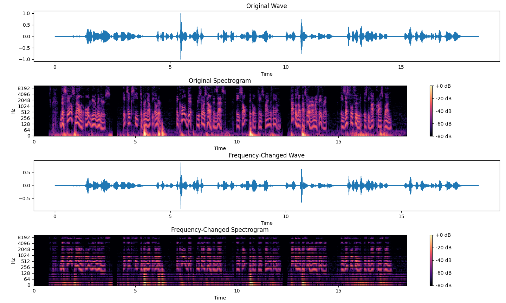

# 2024 ADSP Final Project
Author: R12942086 Chi-Yuan Hsiao

There are two subjects included in the project:
- [Change the Time of a Signal without Varying the Frequency](#i-change-the-time-of-a-signal-without-varying-the-frequency)
- [Change the Frequency of a Signal without Varying the Time](#ii-change-the-frequency-of-a-signal-without-varying-the-time)

All the codes are written in Python. 

## Files
The repository includes the following files:
```sh
ADSP_final
├── images
│   ├── Figure_1.png
│   └── Figure_2.png
├── README.md
├── time_changed.py
├── frequency_changed.py
├── harvard.wav             // example input file
├── time_changed.wav        // example output file 
└── frequency_changed.wav   // example output file
```

## Requirements
- Python 3.x
- `numpy`
- `librosa`
- `matplotlib`
- `soundfile`

You can install the required libraries using pip:
```sh
pip install numpy librosa matplotlib soundfile
```

## Execution
For execution of **time** changing, run the Python script `time_changed.py`:

```sh
python time_changed.py harvard.wav
```
For execution of **frequency** changing, run the Python script `frequency_changed.py`:

```sh
python frequency_changed.py harvard.wav
```

# I. Change the Time of a Signal without Varying the Frequency

## Method
This program demonstrates how to **double the time length of a wave signal without varying the frequency**. The program performs the following steps:

1. Load in a wave signal file.
2. Double its length by linear interpolation.
3. Perform Short-Time Fourier Transform (STFT).
4. Shift the frequency components to double the frequencies.
5. Perform the inverse STFT.
6. Save the modified wave as audio files.
7. Visualize the original and modified waves and their spectrograms.

## Example Result
After running the program, you will get an audio file:

- `time_changed.wav`: 
The altered wave signal with **doubled time length but the same frequency**.

Additionally, the program will display a plot with the following subplots:

1. Original wave.
2. Spectrogram of the original wave.
3. Time-changed wave.
4. Spectrogram of the time-changed wave.


The images above show the original wave and its spectrogram, as well as the modified wave with doubled time length and its spectrogram.

# II. Change the Frequency of a Signal without Varying the Time

## Method
This program demonstrates how to **double the frequency of a wave signal without varying the time length**. The program performs the following steps:

1. Load in a wave signal file.
2. Perform Short-Time Fourier Transform (STFT).
3. Shifts the frequency components to double the frequencies.
4. Perform the inverse STFT.
5. Save the modified wave as audio files.
6. Visualize the original and modified waves and their spectrograms.

## Example Result
After running the program, you will get an audio file:

- `frequency_changed.wav`: 
The altered wave signal with **doubled frequency but the same time length**.

Additionally, the program will display a plot with the following subplots:

1. Original wave.
2. Spectrogram of the original wave.
3. Frequency-changed wave.
4. Spectrogram of the frequency-changed wave.



The images above show the original wave and its spectrogram, as well as the modified wave with doubled frequency and its spectrogram.
